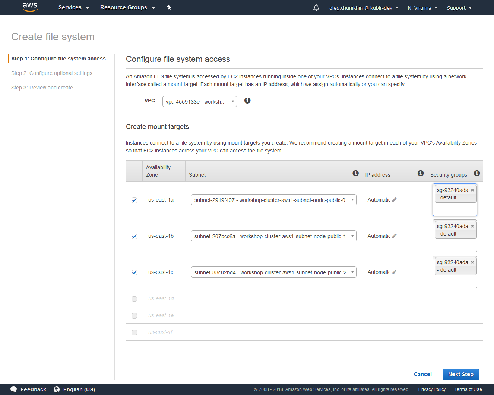

#   Hands-on session: Setting up CI/CD pipeline based on Nexus, Jenkins and Kubernetes on AWS

##  1. Prepare for the session

Start local Kublr Demo if it is not yet started.
Detailed instructions on setting up Kublr Demo and running it are
available at [https://kublr.com/demo/](https://kublr.com/demo/) and
[https://docs.kublr.com/installationguide/bootstrap/](https://docs.kublr.com/installationguide/bootstrap/).

Starting Kublr demo for the first time includes downloading a ~1Gb vagrant box file, so it
may take long time on a slow network.

After the box file is downloaded, Kublr demo virtual machine starts, which may take up
to 5 minutes.

It is recommended to install and run Kublr demo once before the session, preferably while
being connected to a fast Internet connection.

We also recommend to start Kublr before the session start to save time.

##  2. Deploy Kubernetes cluster

1.  Open Kublr console: [https://localhost:9443/](https://localhost:9443/)

    <details>
        <summary></summary>
        
    </details>

2.  Login to Kublr console

    Use `admin` username and `kublrbox` password.

    You will see welcome screen and empty cluster list.

    <details>
        <summary></summary>
        
    </details>

3.  Go to "Credentials" page and click "Add Credentials" button to create a new AWS
    credentials entry.

    Enter `workshop-aws` in the "Name" field, your AWS access key ID in the "Access Key"
    field, and your AWS secret key in the "Secret Key" field.

    <details>
        <summary></summary>
        
    </details>

4.  Go to "Clusters" page again and click "Add Cluster" button.

    This will start cluster creation wizard.

    Enter or select the following values in the form

    *   Provider: Amazon Web Services

    *   Cluster Name: `workshop-cluster` (you may use a different name if a cluster with
        this name already exists)

    *   Select Region: `us-east-1`

    *   Credentials: `workshop-aws`

    *   Masters: 1

    *   Instance Type: `m4.large`

    *   Nodes: 3

    *   Instance Type: `m4.large`

    *   Add Monitoring > Self-hosted Prometheus / Grafana

    *   Ingress: enable

    The completed form will look as follows:

    <details>
        <summary></summary>
        
    </details>

    Click "Confirm and Install" button to start creation of a new cluster.

Cluster creation usually takes 10-20 minutes. You can track progress of this process via
cluster overview, status, and events pages:

<details style="display:inline;">
    <summary></summary>
    
</details>
<details style="display:inline;">
    <summary></summary>
    
</details>
<details style="display:inline;">
    <summary></summary>
    
</details>

After cluster creation is complete, download kubernetes config file from the cluster
overview screen and copy it to `~/.kube/config`

Verify that now Kubernetes client is configured properly by running the following command:

```
kubectl get nodes
```

You should be able to see four nodes - one master and three worker nodes.

In addition, make a note of K8s cluster API endpoint address and admin credentials (login
and password) from the config file.

The config file is in yaml format; the endpoint may be found in the section
`clusters[name='workshop-cluster'].server` and credentials are in the sections
`users[name='workshop-cluster-admin-basic-auth'].user`

Kubernetes cluster API may be checked in a browser on https API endpoint: we will use
`https://18.233.228.40` for the purposes of this document, although each cluster will have
their own address.

You will also have to accept self-signed certificate in the browser and provide admin
credentials to access the API in a browser.

Similarly, Kubernetes dashboard may be accesses via this address at the following URL:
`https://18.233.228.40/api/v1/namespaces/kube-system/services/https:kubernetes-dashboard:/proxy/`

##  3.  Setup AWS EFS for the build pipeline tools

Login to your AWS console and select "EFS" from the list of services in the top left corner.

Press "Create file system" button, which will open file system creation wizard.

Enter or select the following values in the form:

*   For VPC select id of the VPC of the just created Kubernetes cluster - you can look it
    up by the cluster name `workshop-cluster`

*   For each availability zone select node subnet - subnet with the name like
    `workshop-cluster-aws1-subnet-node-public-1`

*   For security groups fields select `default` security group

<details>
    <summary></summary>
    
</details>

Press "Next Step"

Enter name of the EFS file system (optional) and leave other options as is in the next screen.

<details>
    <summary></summary>
    
</details>

Press "Next Step"

Review parameters

<details>
    <summary></summary>
    
</details>

Press "Create File System" button.

<details>
    <summary></summary>
    
</details>

From the EFS file system overview page make a note of "DNS name" field value.

In this case it is `fs-760ba53e.efs.us-east-1.amazonaws.com`

##  4. Clone project sources

Go to your work directory and clone workshop project sources from GirHub.

```
mkdir ~/workshop
git clone https://github.com/kublr/workshop-build-pipeline.git
```

##  5. Prepare common objects in K8S cluster

CD to the `workshop-build-pipeline` project directory

```
cd workshop-build-pipeline
```

Register a persistent volume for the EFS file system in the Kubernetes cluster.

To do that first edit file `build/efs-pv.yaml` - modify `spec.nfs.server` fields by
putting there the DNS name of the EFS file system we created in the section 3 above.
For the purposes of this document this value is
`fs-760ba53e.efs.us-east-1.amazonaws.com`.

Run a command to create a persistent volume in the Kubernetes database for the EFS
file system:

```
kubectl apply -f build/efs-pv.yaml
```

Next, create `build` namespace and a persistent volume claim in that namespace that
binds to the persistent volume.

Pods cannot work with persistent volumes (non-namespaced objects) directly, they can
only work with them through persistent volume claims in the same namespace, bound to
a persistent volume.

```
kubectl create namespace build

kubectl apply -f build/efs-pvc.yaml
```

You can check that the persistent volume claim is created and bound via Kubernetes
dashboard or CLI `kubectl` utility:

```
kubectl get pvc -n build
```
Expected result:
```
NAME      STATUS    VOLUME    CAPACITY   ACCESS MODES   STORAGECLASS   AGE
efs       Bound     efs       50Gi       RWX                           <invalid>
```

##  6. Deploy and configure Nexus repository in K8S cluster

Deploy Nexus deployment and service objects:

```
kubectl apply -f build/nexus/nexus-deployment.yaml
kubectl apply -f build/nexus/nexus-service.yaml
```

Open Nexus UI at `http://18.233.228.40:30081/`

<details>
    <summary></summary>
    
</details>

Login ("Sign In" button in the top right corner) using initial administrator
credentials - username `admin` and password `admin123`.

Create a hosted docker repository:

1.  Go to "Server administration and configuration" screen (cog button at the top)

2.  Open "Repositories" screen

    <details>
        <summary></summary>
        
    </details>

3.  Click "Create repository" button and select "docker (hosted)" repository type; fill the form with the following values:

    *  Name: docker0
    *  HTTP port: 5000

    <details>
        <summary></summary>
        
    </details>

    and click "Create repository" button.

##  7. Deploy and configure Jenkins in K8S cluster

Deploy Jenkins deployment and service objects:

```
kubectl apply -f build/jenkins/jenkins-deployment.yaml
kubectl apply -f build/jenkins/jenkins-service.yaml
```

Open Jenkins UI at `http://18.233.228.40:30080/`

<details>
    <summary></summary>
    
</details>

Install required Jenkins plugins:

1.  Go to "Manage Jenkins" > "Manage Plugins" > "Available" screen

2.  select the following plugins

    *   Kubernetes

    *   Pipeline

    *   Timestamper

    *   Git

3.  Click "Download now and install after restart"

4.  In the next screen check ckeckbox labeled "Restart Jenkins when installation is
    complete and no jobs are running"

Plugin download, installation, and following Jenkins restart may take up to 5 minutes.

##  8. Setup Jenkins to run dynamically allocated workers as pods in K8S cluster

Set number of master-based executors to 0:

1.  Go to "Build Executor Status" > "Configure" (on "master")

2.  Set "# of executors" to 0

    <details>
        <summary></summary>
        
    </details>

3.  Click "Save" button

Configure Jenkins "Kubernetes cloud"

1.  Go to "Manage Jenkins" > "Configure System" > "Add a new cloud" > "Kubernetes"

2.  Fill in the following values in the form:

    *   Kubernetes URL: https://kubernetes.default.svc.cluster.local

    *   Kubernetes Namespace: `default`

    *   Jenkins URL: http://jenkins.build.svc.cluster.local:8080

    <details>
        <summary></summary>
        
    </details>

3.  Click "Save" button

##  9. Setup a CI job on Jenkins

Fork and clone demo application GitHub project

1.  Open https://github.com/kublr/workshop-build-pipeline-demo-app

2.  Fork the project into your GitHub account. For the purposes of this document I will
    use the project forked to my account `olegch` at
    https://github.com/olegch/workshop-build-pipeline-demo-app

3.  Go to your work directory and clone the project

    ```
    cd ~/workshop
    git clone git@github.com:olegch/workshop-build-pipeline-demo-app.git
    cd workshop-build-pipeline-demo-app
    ```

Configure Jenkins secrets/credential for the job

1.  In Jenkins UI go to "Credentials" > "System" > "Global credentials (unrestricted)" > "Add Credentials"

    -   Kind: Username with password

    -   Scope: Global

    -   Username: admin

    -   Password: admin123

    -   ID: docker-registry

    <details>
        <summary></summary>
        
    </details>

    Click "Ok" button

2.  In Jenkins UI go to "Credentials" > "System" > "Global credentials (unrestricted)" > "Add Credentials"

    -   Kind: Secret file

    -   Scope: Global

    -   upload config.yaml for the cluster

    -   ID: k8s-config

    <details>
        <summary></summary>
        
    </details>

    Click "Ok" button

Create and run CI job

1.  In Jenkins UI click "New Item" and specify the job type and name:

    *   Name: workshop-demo-app-build

    *   Type: Multibranch Pipeline

    <details>
        <summary></summary>
        
    </details>

    Click "Ok" button

2.  Fill in the job configuration wizard form

    *   In "Branch Sources" section click "Add source" > "Git"

        *   Project Repository: https://github.com/olegch/workshop-build-pipeline-demo-app.git

            *   in "Behaviors" click "Add" > "Filter by name (with wildcards)"

                *   Include: `*`

            *   In "Behaviors" click "Add" > "Check out to matching local branch"

    *   In "Scan Multibranch Pipeline Triggers"

        *   Check "Periodically if not otherwise run"

        *   Set interval to "1 minute"

    <details>
        <summary></summary>
        
    </details>

3.  Click "Save" and watch the first scan, build and deployment of the project.

After the first build on the `master` branch successfully completes, the application
may be accessed and tested through Kubernetes API at
https://18.233.228.40/api/v1/namespaces/master/services/demo-app-master:3000/proxy/

## 10. Test application updates

Modify application code in a feature branch and test it after automatic build and deploy

1.  Create a feature branch

    ```
    git checkout -b feature/demo
    ```

2.  Edit application code

    ```
    vim src/app.sj
    ````

3.  Commit and push changes

    ```
    git commit -a -m "Code updated"
    git push origin feature/demo
    ```

4.  Wait for a minute or initiate manual git rescan in the Jenkins build job

5.  After build and deployment process is complete, updated application is deployed in
    `featuredemo` namespace and can be tested via Kubernetes API at
    https://18.233.228.40/api/v1/namespaces/featuredemo/services/demo-app-featuredemo:3000/proxy/

Merge the feature branch to master, and verify application updated in `master` namespace

1.  Merge master

    ```
    git checkout master
    git merge feature/demo
    git push origin master
    ```

2.  Wait for a minute or initiate manual git rescan in the Jenkins build job

3.  After build and deployment process is complete, updated application is available in
    `master` namespace and can be tested via Kubernetes API at
    https://18.233.228.40/api/v1/namespaces/master/services/demo-app-master:3000/proxy/

## 11. Cleanup

1.  Delete AWS EFS file system created in the section 3 above

2.  Delete Kubernetes cluster in Kublr UI
